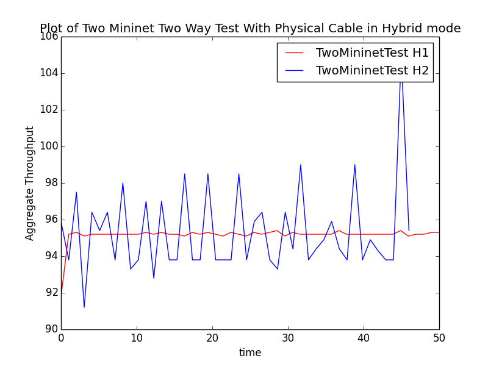
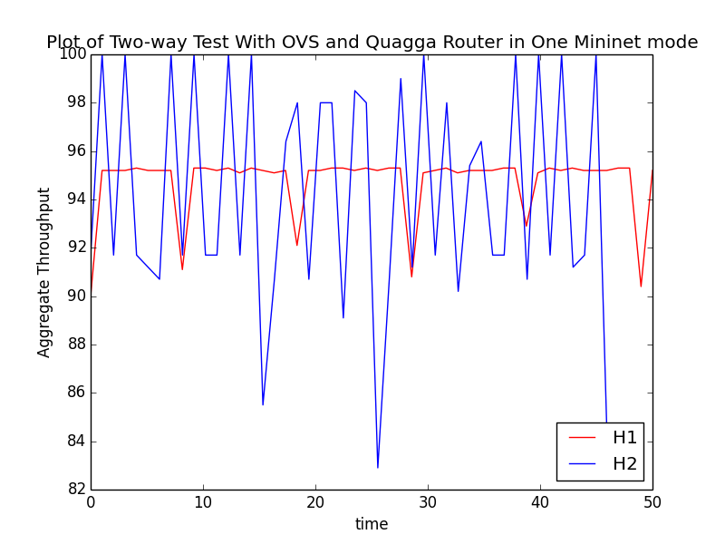

# Performance Evaluation

We designed topologies based on our previous testbed validation. The new coponent is software router which make virtual host in mininet a router. In our performance evaluation, all software routers are running OSPF routing protocols and we want to prove that our testbed can maintain good performance when adding non-SDN components into our hardware-in-the-loop SDN testbed.

# 1. One Mininet

## Two-way Topology(One Mininet):

Two-way test is the basic experiment to validate the fidelity of our Mininet-Quagga testbed. We conduct a two-way perf test on a simple topology to check the impact of non-SDN components (Quagga router) in SDN network.

/Twoway/Twoway(OneMininet).png)

/Twoway/test.png)

From the result we can see both connections have an average throughput above 90 Mbits/sec.

## Fork-in Topology:

We did fork-in test to evaluate the in-boud traffic queuing processing performance of Quagga routers.

/ForkIn/ForkIn(OneMininet).png)

/ForkIn/ForkIn2.png)

## Fork-out Topology:

Fork-out test aims to check whether Quagga router can make out-boud traffic get a fair share of bandwdith resources.

/ForkOut/ForkOut(OneMininet).png)

/ForkOut/ForkOut.png)

# 2. Two Mininet

## Two-way Topology(Two Mininet):

We put two-way test components in two mininet by spliting the one mininet topology symmetrically. The goal is to prove a substitution of virtual link into physical link will not make performance down. 

.png)

# 3. Hybrid

## Two-way Topology(Add Pica8):

There are 2 aspects that need to be evaluated in Hybrid mode: the physical port and Pica8 switch. By introducing non-SDN components into SDN network topology, we made our testbed capable of emulating traditional network experiment other than SDN network experiment. With both virtual and physical components inside, we have maintain the fidelity as well as scalability and reproducibility.

.png)

