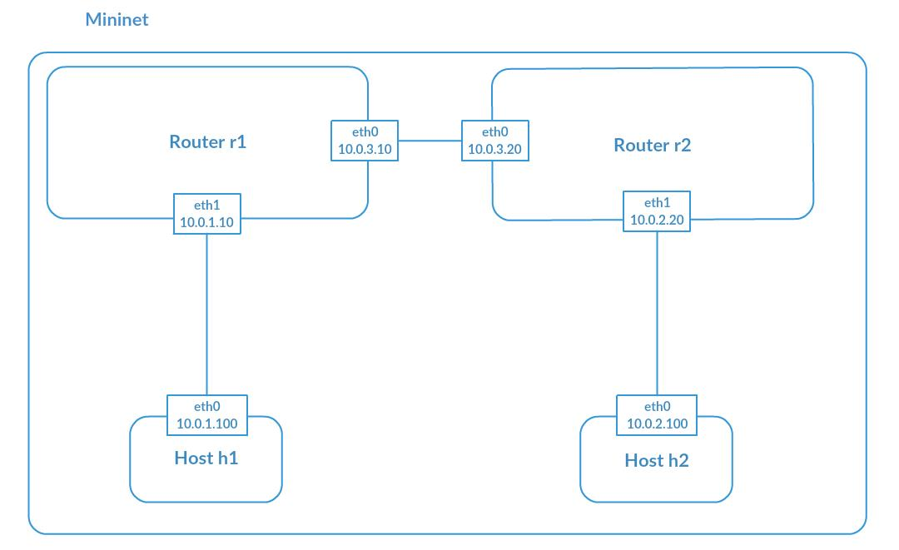
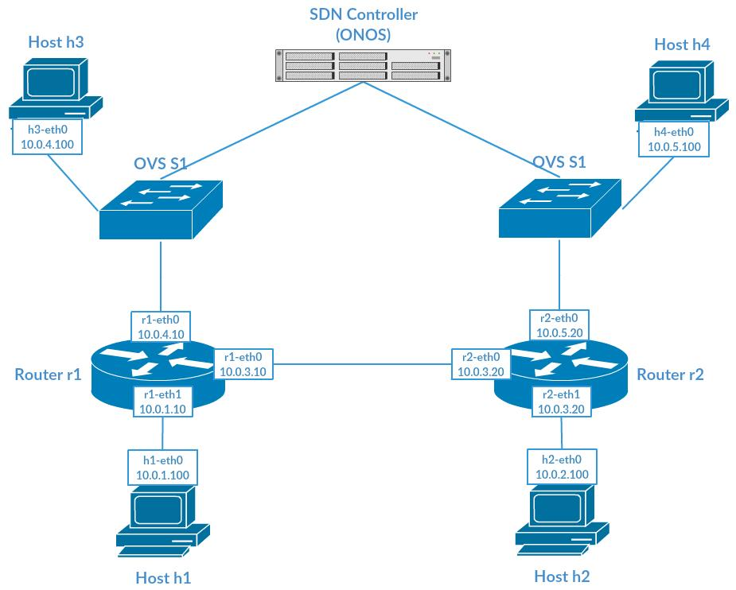

# 1. Quagga Install And Configuration

## Quagga Install Guide:

http://blog.chinaunix.net/uid-25513153-id-212328.html

## Download Quagga:

http://download.savannah.gnu.org/releases/quagga/quagga-1.2.1.tar.gz

## Unzip and Configure:

> $ ./configure --enable-vtysh --enable-user=root --enable-group=root --enable-vty-group=root

### If GNU awk is required:

> $ sudo apt-get install gawk

### If libreadline is required:

> $ sudo apt-get install libreadline6 libreadline6-dev

### If libcares is required:

> $ sudo apt-get install libc-ares-dev

## Make:

> $ make

### If aclocal-1.15 is missing:

> $ sudo apt-get install automake

### If makeinfo is missing:

> $ sudo apt-get install texinfo

## Make install:

> $ sudo make install

## Make new file, copy zebra.conf.sample to zebra.conf:

> $ cd /usr/local/etc

> $ sudo cp zebra.conf.sample zebra.conf

## Quagga(Zebra) Service Start:

> $ sudo zebra -d

### If zebra: error while loading shared libraries: libzebra.so.1: cannot open shared object file: No such file or directory

> $ cd /usr/local/lib

> $ sudo cp libzebra.* /lib

> $ sudo rm libzebra.*

## Connect to zebra using telnet(password zebra):

> $ telnet localhost 2601

# 2. Run OSPF Experiment (One Mininet)

## Experiment Topo:



## Create Zebra Configuration File for router r1 and r2:

> $ cd /usr/local/etc

> $ cp zebra.conf r1zebra.conf

> $ cp zebra.conf r2zebra.conf

## Create OSPF Configuration File for router r1 and r2:

> $ cd /usr/local/etc

> $ cp ospfd.conf r1ospfd.conf

> $ cp ospfd.conf r2ospfd.conf

## Edit OSPF configuration File:
### Edit r1ospfd.conf
```
hostname r1_ospfd
password 123
enable password 123

router ospf
  ospf router-id 10.0.3.10
  network 10.0.3.0/24 area 0
  network 10.0.1.0/24 area 0
  network 10.0.4.0/24 area 0
debug ospf event
log file /usr/local/etc/r1ospfd.log
```
### Edit r2ospfd.conf
```
hostname r2_ospfd
password 123
enable password 123

router ospf
  ospf router-id 10.0.3.20
  network 10.0.3.0/24 area 0
  network 10.0.2.0/24 area 0
  network 10.0.5.0/24 area 0
debug ospf event
log file /usr/local/etc/r2ospfd.log
```
## Start Mininet Script:

> $ sudo python QuaggaOSPF.py

# 3. Run OSPF Experiment (Hybrid)

## Experiment Topo:


## Run Mininet Script on PC1:

> $ sudo python QuaggaOSPF (hybrid).py

## Edit OSPF Configuration File on PC2:

> $ cd /usr/local/etc

> $ nano ospfd.conf

## Run Zebra and OSPF on PC2:

> $ sudo zebra -d

> $ sudo ospfd -d

## Configure IP address and gateway on Pi:

> $ sudo ifconfig eth0 ?

> $ sudo route add default gw ?

# 4. Run SDN and Non-SDN Combination Experiment

## Experiment Topo:


# Trouble Shooting
## 1.OSPF service wait a long time before adding route.

